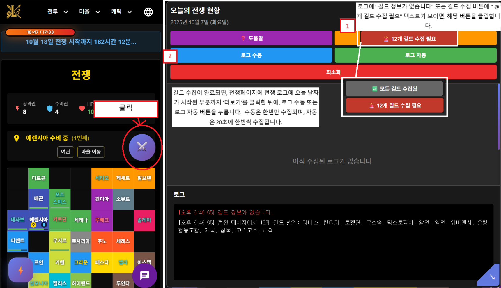

# 라니스 전쟁 현황 트래커 (코스모스용)

Lanis 웹 페이지에서 사용자 경험을 향상시키기 위해 만든 **Chrome 확장 프로그램**입니다.  

---

## 주요 기능

* =====================================================
* 【참고 및 도움 주신분】
*  도히님 - https://github.com/dohits/lanis_helper?tab=readme-ov-file
*
* 【주요 기능】
* 1. 전쟁 로그 실시간 수집 및 분석
* 2. 길드별 공격권/수비권 추적
* 3. 마을별 점령 현황 추적
* 4. 전쟁 통계 생성 (최다 공격자, 최다 방어자 등)
* 5. 로컬스토리지 자동 저장/불러오기 (날짜 기반)
* 6. 누락된 길드 자동 감지 및 수집
*
* @version 1.3
* @author WIFM
* @license MIT

---

## 설치 방법

### 0. 아래 zip파일 다운로드
1. 최신 릴리즈: [다운로드 ZIP](https://github.com/taesan1/LanisWarMonitoring/releases/download/V1/lanisWarMonitoring.zip)

### 1. PC(Chrome 브라우저)
1. 최신 릴리즈 zip 파일 다운로드 후 압축 해제  [다운로드 ZIP](https://github.com/taesan1/LanisWarMonitoring/releases/download/V1/lanisWarMonitoring.zip)
2. Chrome 브라우저에서 검색창에 `chrome://extensions/`  입력 후 접속 접속   
3. 우측 상단 **개발자 모드** 활성화
4. **압축해제된 확장 프로그램을 로드합니다** 클릭 → 프로젝트 폴더 선택

### 2. 모바일(Android, ) 또는 구글 확장프로그램이 지원되는 브라우저
1. 키위브라우저 접속. 또는 구글 확장프로그램이 지원되는 브라우저 [링크이동](https://play.google.com/store/apps/details?id=com.kiwibrowser.browser&hl=ko&pli=1)
2. 하단 바 퍼즐 아이콘 클릭 → 확장 프로그램 선택
3. 개발자 모드 활성화 → `+` 버튼으로 zip 파일 불러오기
---

## 사용 방법

1.  **이미지 참조**

- 메인 버튼 클릭(우측 중앙)
-
- 길드 정보가 없다고 뜰 시에, "@개 길드 수집 필요"버튼을 클릭,
- "@개 길드 수집 필요" 문구는 길드 데이터가 7일 이상 지났거나, 새로운 길드가 나타났을 시 뜹니다
- 
- 길드 정보가 수집되었으면,  전쟁화면 "전쟁 로그"에 오늘 날짜가 보이게 더보기 버튼을 클릭
- 수동/자동 수집 로그 수집 버튼 클릭

**

---

## 다운로드

최신 릴리즈: [다운로드 ZIP](https://github.com/taesan1/LanisWarMonitoring/releases/download/V1/lanisWarMonitoring.zip)

